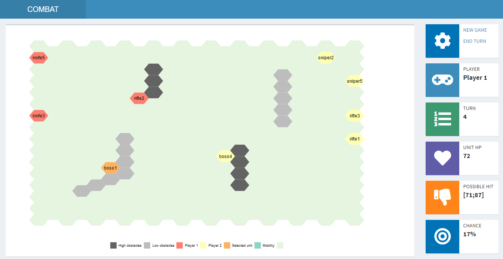

# combatGame

This is simple combat game written in Shiny. You can fight with 5 types of units:

- knife - high mobility, average attack, low range and accuracy,
- glock - an average mobility, low attack and range, an average accuracy,
- rifle - an average mobility, high attack, range and accuracy,
- sniper - low mobility, high attack, range and accuracy,
- boss - high mobility, attack range and accuracy.

There can be only one boss in each team, so you must protect him.

In your turn you can choose any of your unit by click it. Then you will see the possible mobility hexes. By clicking in one of them you will move that unit. Hover any unit to see its HP. By double click you can attack any opponent which there is the range of your unit. 

Below the game map there is log, which shows all moves done during game.

In the game the simple AI algorithm is implemented. Based on the present state of the game it consider 10 x number of units possible actions and choose the best one. 

